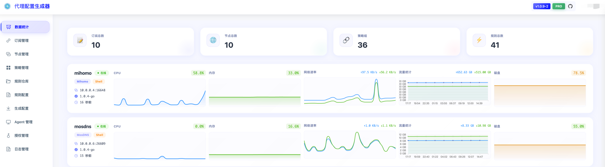

<div align="center">

# ConfigFlow

### 🚀 现代化代理配置管理平台

[](LICENSE)
[](https://hub.docker.com/r/thsrite/config-flow)
[](https://python.org)
[](https://vuejs.org)

**一站式管理订阅、节点、规则，一键生成 Mihomo / Surge / MosDNS 配置**

[功能特性](#-功能特性) •
[快速开始](#-快速开始) •
[文档](#-文档) •
[截图预览](#-截图预览)

</div>

---

## ✨ 功能特性

<table>
<tr>
<td width="50%">

### 📦 订阅管理
- 多订阅源支持（Mihomo/Surge/通用格式）
- 自动解析订阅获取节点
- 支持 Base64、YAML、URI 多种格式

### 🌐 节点管理
- 可视化节点管理
- 支持 SS/SSR/VMess/Trojan/Hysteria/Hysteria2
- 手动添加与编辑

### 📋 规则仓库
- 集中管理规则集（rule-providers）
- 批量导入 YAML 格式规则
- 连通性测试与自动关闭

</td>
<td width="50%">

### 🎯 策略组配置
- 手动选择 / 自动测速 / 故障转移 / 负载均衡
- 多维度节点筛选
- 支持引用其他策略组

### ⚡ 配置生成
- 一键生成 Mihomo YAML 配置
- 一键生成 Surge 配置
- 一键生成 MosDNS 配置
- 实时预览 & 配置导入导出

### 🤖 Agent 远程管理
- 一键生成安装脚本
- 自动注册与心跳监控
- 远程推送配置、重启、日志查看

</td>
</tr>
</table>

---

## 🚀 快速开始

### Docker 部署（推荐）

```bash
docker run -d \
  --name config-flow \
  -p 80:80 \
  -v $(pwd)/data:/data \
  -e ADMIN_USERNAME=admin \
  -e ADMIN_PASSWORD=your_password \
  -e JWT_SECRET_KEY=your-secret-key \
  thsrite/config-flow:latest
```

访问 `http://localhost` 即可使用

### Docker Compose

```yaml
version: '3.8'
services:
  config-flow:
    image: thsrite/config-flow:latest
    ports:
      - "80:80"
    volumes:
      - ./data:/data
    environment:
      - ADMIN_USERNAME=admin
      - ADMIN_PASSWORD=your_password
      - JWT_SECRET_KEY=your-secret-key
    restart: unless-stopped
```

> 💡 **提示**：生产环境请务必修改默认密码和 JWT 密钥

---

## 📖 文档

详细使用文档请查看：**[ConfigFlow 使用指南](configflow_doc/README.md)**

---

## 📸 截图预览

<div align="center">

<br/><br/>

</div>

---

## 🏗️ 技术栈

| 层级 | 技术 |
|------|------|
| **后端** | Python 3.11 • Flask • PyYAML |
| **前端** | Vue 3 • TypeScript • Element Plus • Vite |
| **部署** | Docker • Nginx • Supervisor |

---

## 📁 项目结构

```
config-flow/
├── backend/                # Python Flask 后端
│   ├── app.py             # 主应用入口
│   ├── common/            # 公共模块 (认证、配置)
│   ├── routes/            # API 路由
│   ├── converters/        # 配置生成器 (Mihomo/Surge/MosDNS)
│   ├── agents/            # Agent 管理
│   └── utils/             # 工具函数
├── frontend/              # Vue 3 前端
│   └── src/
│       ├── views/         # 页面组件
│       ├── components/    # 公共组件
│       └── api/           # API 调用
├── configflow_doc/        # 项目文档
├── Dockerfile
├── docker-compose.yml
└── nginx.conf
```

---

## 📄 许可证

本项目基于 [MIT License](LICENSE) 开源

---

## ❤️ 赞助支持

如果这个项目对你有帮助，欢迎赞助支持开发者持续维护！

<a href="https://ifdian.net/order/create?user_id=1ed9d800ada811f0bdbe52540025c377&remark=&affiliate_code=" target="_blank">
  
</a>

---

<div align="center">

**⭐ 如果觉得有用，请给个 Star 支持一下！**

Made with ❤️ by [thsrite](https://github.com/thsrite)

</div>
