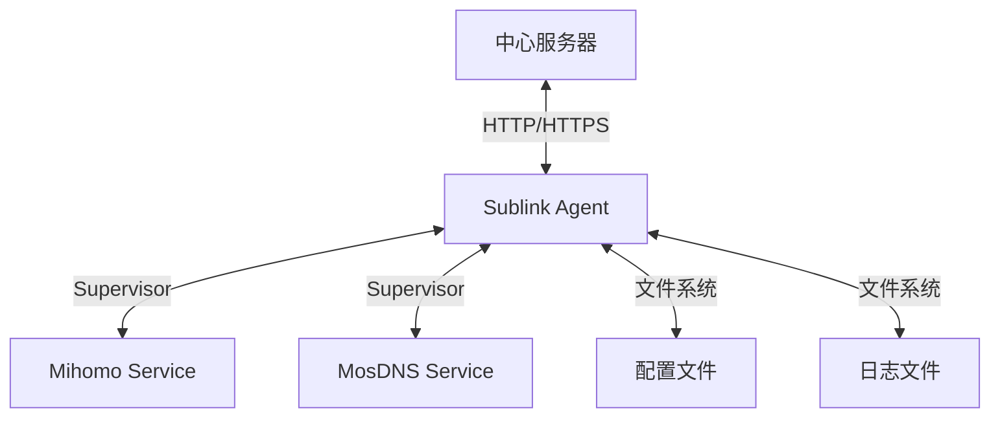
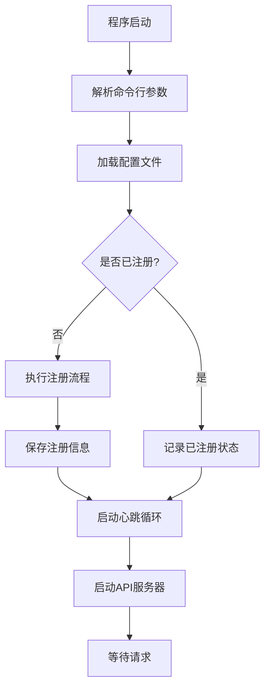
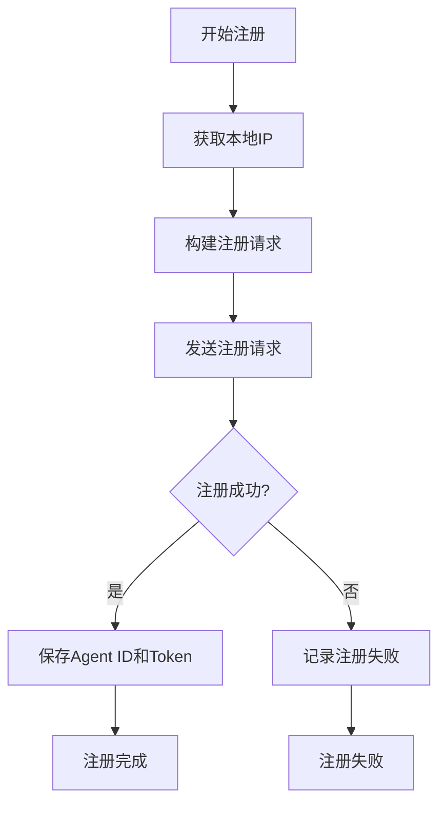
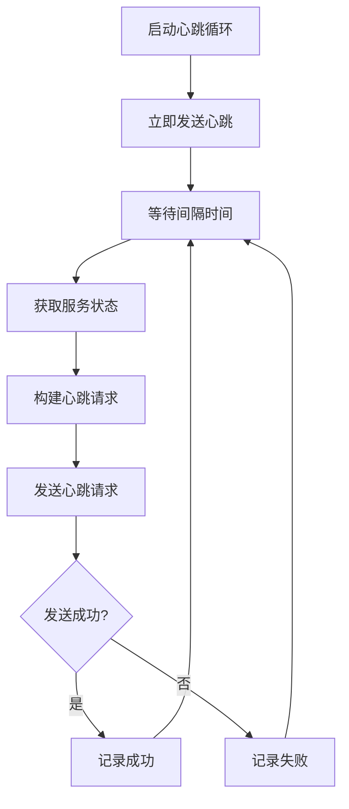
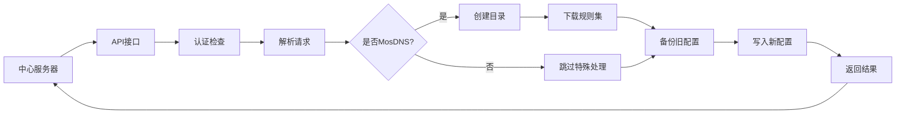
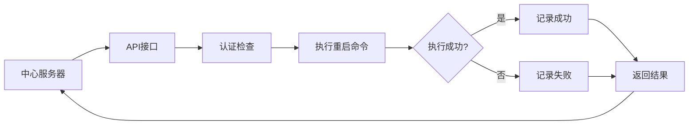

# 系统架构

Sublink Agent 采用模块化设计，各组件职责明确，便于维护和扩展。

## 整体架构图



## 核心组件

### 1. 主程序 (main.go)

主程序负责整个 Agent 的启动和初始化流程：

1. 解析命令行参数和配置文件路径
2. 加载配置文件
3. 执行注册流程（如果未注册）
4. 启动心跳循环
5. 启动 API 服务器

### 2. 配置管理 (config.go)

配置管理模块负责：

- 配置文件的加载和解析
- 配置项的验证和默认值设置
- 配置的持久化保存
- 线程安全的配置访问

### 3. API 服务 (api.go)

API 服务模块提供 RESTful 接口：

- 健康检查接口
- 配置更新接口
- 服务重启接口
- 日志查看接口
- 卸载接口
- 认证中间件

### 4. 客户端功能 (client.go)

客户端功能模块负责与中心服务器通信：

- Agent 注册
- 心跳包发送
- 状态信息上报

### 5. 系统工具 (system.go)

系统工具模块提供底层系统操作：

- IP 地址获取
- 服务状态检查
- 命令执行
- 文件操作

### 6. 心跳管理 (heartbeat.go)

心跳管理模块负责：

- 定时发送心跳包
- 处理心跳响应
- 维护与中心服务器的连接状态

## 工作流程

### 启动流程



### 注册流程



### 心跳流程



## 数据流

### 配置更新数据流



### 服务重启数据流



## 技术栈

### 编程语言
- Go 1.21+

### 核心依赖
- 标准库：`net/http`, `os`, `exec`, `json` 等
- 第三方：无（保持轻量级）

### 运行时环境
- Linux 系统
- Supervisor 进程管理器
- Docker（可选，推荐）

### 构建工具
- Go Modules 包管理
- Docker 多阶段构建

## 设计原则

### 1. 安全性
- 所有 API 接口都需要 Token 认证
- 敏感信息（Token）不记录在日志中
- 配置文件权限严格控制
- 以非 root 用户运行服务

### 2. 可靠性
- 心跳机制确保连接状态
- 配置更新时自动备份
- 错误处理和日志记录完善
- 优雅的启动和关闭流程

### 3. 可扩展性
- 模块化设计，易于添加新功能
- 支持多种服务类型（Mihomo、MosDNS）
- 配置驱动，无需修改代码即可适应不同环境

### 4. 易用性
- 提供完整的 Docker 部署方案
- 详细的文档和示例
- 清晰的错误信息和日志
- 简单的配置方式

## 目录结构

```
.
├── api.go              # API 服务实现
├── client.go           # 客户端注册和心跳功能
├── config.go           # 配置文件加载和保存
├── docker-compose.yaml # Docker Compose 配置
├── docker-entrypoint.sh# Docker 入口点脚本
├── Dockerfile          # Docker 构建文件
├── go.mod              # Go 模块定义
├── go.sum              # Go 模块校验和
├── heartbeat.go        # 心跳循环实现
├── main.go             # 程序入口
├── system.go           # 系统相关工具函数
├── supervisord.conf    # Supervisor 主配置文件
├── supervisor/         # Supervisor 服务配置文件
│   ├── agent-mihomo.conf
│   ├── agent-mosdns.conf
│   ├── mihomo.conf
│   └── mosdns.conf
└── docs/               # 文档目录
    ├── API.md          # API 接口文档
    ├── ARCHITECTURE.md # 架构文档
    ├── CONFIG.md       # 配置说明文档
    ├── DEPLOYMENT.md   # 部署指南
    └── README.md       # 项目说明文档
```

## 扩展性设计

### 添加新服务类型

要支持新的服务类型，需要：

1. 在配置文件中添加相应的服务类型配置
2. 在 API 服务中添加特殊处理逻辑（如果需要）
3. 在系统工具中添加服务状态检查逻辑
4. 创建对应的 Supervisor 配置文件

### 添加新 API 接口

要添加新的 API 接口：

1. 在 [api.go](file:///vol1/1000/docker/go-agent/api.go) 中实现接口处理函数
2. 在 [StartAPIServer](file:///vol1/1000/docker/go-agent/api.go#L528-L550) 函数中注册路由
3. 如需要认证，在路由注册时添加 [authMiddleware](file:///vol1/1000/docker/go-agent/api.go#L37-L61)

### 添加新配置项

要添加新的配置项：

1. 在 [Config](file:///vol1/1000/docker/go-agent/config.go#L11-L32) 结构体中添加字段
2. 在需要使用该配置项的地方添加处理逻辑
3. 更新配置文档说明新字段的用途