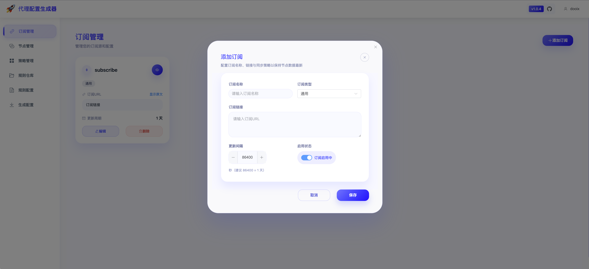
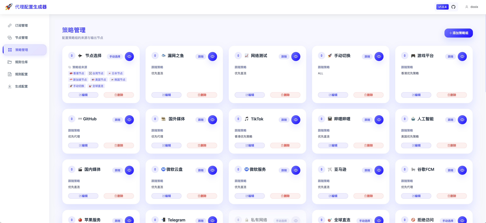
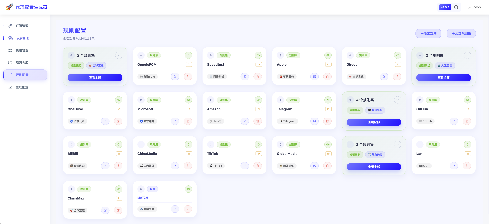
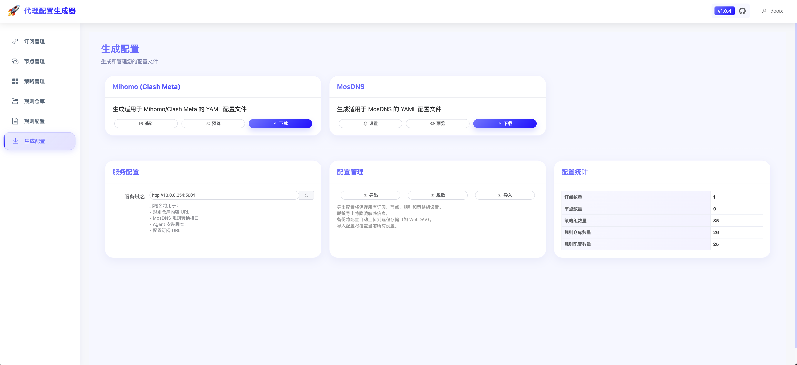

# 快速开始

- [安装与入门指南](install_guide.md)

---

# 功能介绍

## 项目简介

代理配置生成器是一个功能强大的 Web 工具，帮助您轻松管理代理订阅、节点、策略组和规则，并一键生成标准的 Mihomo (Clash Meta)、Surge（敬请期待） 和 MosDNS 配置文件。

**核心价值：**
- 🎯 **可视化配置管理** - 通过直观的 Web 界面管理所有配置，告别手写 YAML
- 🚀 **高效批量操作** - 支持批量导入节点、规则，快速构建配置
- 📦 **集中式规则仓库** - 统一管理所有规则集，轻松复用
- 🔄 **灵活的策略组** - 支持多种策略类型和节点来源组合
- 💾 **配置导入导出** - 完整的配置备份和迁移能力

### 交流频道
- [ConfigFlow交流群](https://t.me/+fLt02_w38205OTNh)

---







## 核心功能

### 📝 订阅管理

集中管理多个代理订阅源，支持 Mihomo、Surge（敬请期待） 和通用格式。

**主要特性：**
- 添加和管理多个订阅源
- 支持多种订阅格式（base64、YAML、URI）
- 拖拽排序订阅列表
- 自动清理策略组引用

[查看详细文档 →](module/subscription.md)

---

### 🖥️ 节点管理

完整的节点增删改查功能，支持单个添加和批量导入。

**主要特性：**
- 支持多种协议：SS、VMess、VLess、Trojan、Hysteria2
- 三种添加格式：URI、JSON、YAML
- 批量添加/删除节点
- 节点启用/禁用
- 拖拽排序
- 自动清理策略组引用

[查看详细文档 →](module/nodes.md)

---

### 🎯 策略管理

配置多种类型的策略组，支持灵活的节点来源组合。

**策略类型：**
- **Select** - 手动选择节点
- **URL-Test** - 自动测速选择最快节点
- **Fallback** - 故障转移
- **Load-Balance** - 负载均衡

**节点来源：**
- 订阅来源筛选
- 正则表达式过滤
- 手动选择节点
- 引用其他策略组
- 跟随模式

[查看详细文档 →](module/proxy-groups.md)

---

### 📚 规则仓库

集中管理所有规则集，方便在多个规则配置中复用。

**主要特性：**
- 支持三种规则类型：domain、ipcidr、classical
- URL 或本地内容两种来源
- 批量导入 YAML 格式规则
- 规则引用跟踪
- 拖拽排序

[查看详细文档 →](module/rule-library.md)

---

### ⚡ 规则配置

创建具体的分流规则，支持14种规则类型。

**主要特性：**
- 支持 14 种规则类型（DOMAIN、DOMAIN-SUFFIX、IP-CIDR、GEOIP 等）
- 批量导入域名
- 从规则仓库选择规则集
- 规则拖拽排序
- 规则集自动分组显示
- 启用/禁用规则

[查看详细文档 →](module/rules.md)

---

### 🚀 配置生成

一键生成标准配置文件，支持导入导出。

**主要特性：**
- 生成 Mihomo (Clash Meta) 配置
- 生成 MosDNS 配置
- 配置预览（语法高亮）
- 配置导出为 JSON
- 配置导入（支持拖拽）
- 实时配置统计

[查看详细文档 →](module/generate.md)

---

## 快速开始

### 1. 部署系统

使用 Docker 快速部署：

```bash
docker run -d \
  --name config-flow \
  -p 80:80 \
  -v $(pwd)/data:/data \
  -e ADMIN_USERNAME=admin \
  -e ADMIN_PASSWORD=admin123 \
  -e JWT_SECRET_KEY=your-secret-key-please-change-in-production \
  thsrite/config-flow:latest
```

访问 `http://localhost` 即可使用。

> 请把 `ADMIN_PASSWORD` 和 `JWT_SECRET_KEY` 替换为更安全的值，生产环境务必更新凭据。

[查看完整部署指南 →](module/deployment.md)

### 2. 基本使用流程

**第一步：添加订阅或节点**
- 进入「订阅管理」添加订阅源
- 或进入「节点管理」手动添加节点

**第二步：配置规则仓库**
- 进入「规则仓库」添加常用规则集
- 推荐使用 Loyalsoldier 等开源规则

**第三步：创建策略组**
- 进入「策略管理」创建策略组
- 按地区或用途组织节点

**第四步：配置规则**
- 进入「规则配置」添加分流规则
- 从规则仓库引用规则集

**第五步：生成配置**
- 进入「配置生成」
- 预览并下载配置文件
- 导入到代理客户端使用

### 3. 配置示例

**简单配置示例：**

```
1. 添加订阅：香港机场
2. 创建策略组：
   - 🇭🇰 香港节点（url-test，自动选择最快节点）
   - ✈️ 代理选择（select，手动选择）
3. 配置规则：
   - 规则集：proxy → ✈️ 代理选择
   - 规则集：direct → DIRECT
   - GEOIP: CN → DIRECT
   - MATCH → ✈️ 代理选择
4. 生成并下载 Mihomo 配置
```
---

## 文档导航

### 功能文档
- [订阅管理](module/subscription.md) - 管理代理订阅源
- [节点管理](module/nodes.md) - 添加和管理代理节点
- [策略管理](module/proxy-groups.md) - 配置策略组
- [规则仓库](module/rule-library.md) - 集中管理规则集
- [规则配置](module/rules.md) - 创建分流规则
- [配置生成](module/generate.md) - 生成和导出配置

### 部署文档
- [部署指南](module/deployment.md) - Docker 和 Docker Compose 部署
---

## 常见问题

**Q: 支持哪些代理协议？**

A: 支持 Shadowsocks、VMess、VLess、Trojan、Hysteria2 等主流协议。

**Q: 如何备份配置？**

A: 在「配置生成」页面点击"导出配置"，将所有配置导出为 JSON 文件。

**Q: 规则的优先级如何确定？**

A: 规则按照从上到下的顺序匹配，第一个匹配的规则生效。可以通过拖拽调整顺序。

**Q: 可以同时使用多个订阅吗？**

A: 可以，系统支持添加多个订阅源，在策略组中可以选择从特定订阅筛选节点。

**Q: 如何更新到最新版本？**
```bash
docker stop config-flow
docker rm config-flow
docker pull thsrite/config-flow:latest
docker run -d --name config-flow -p 80:80 -v $(pwd)/data:/data thsrite/config-flow:latest
```

